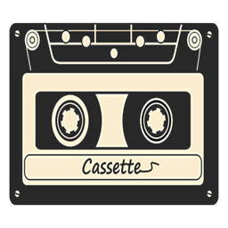
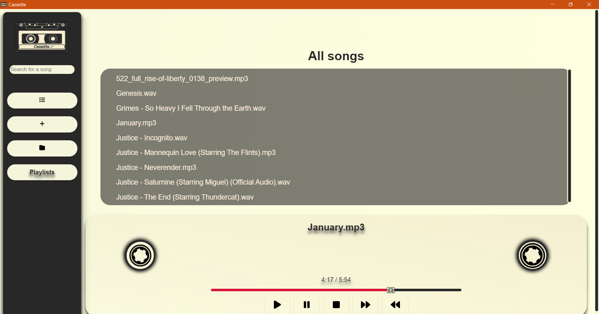
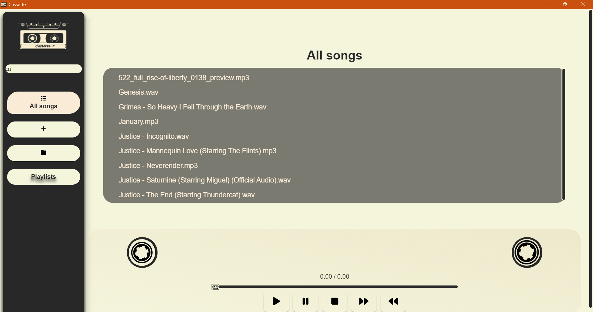
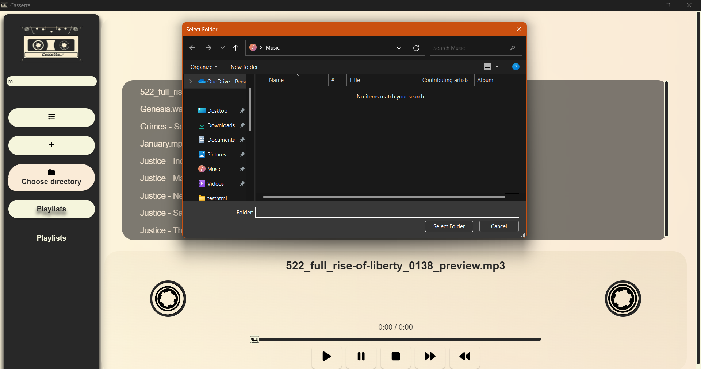
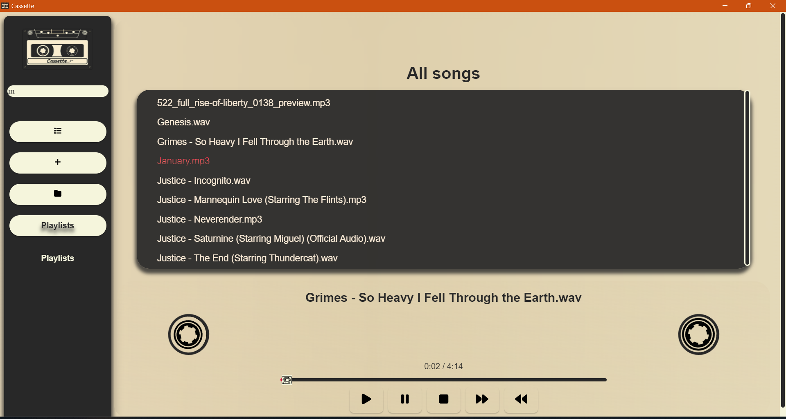
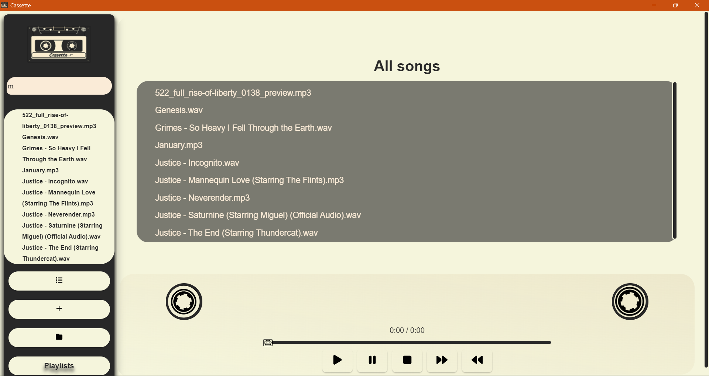
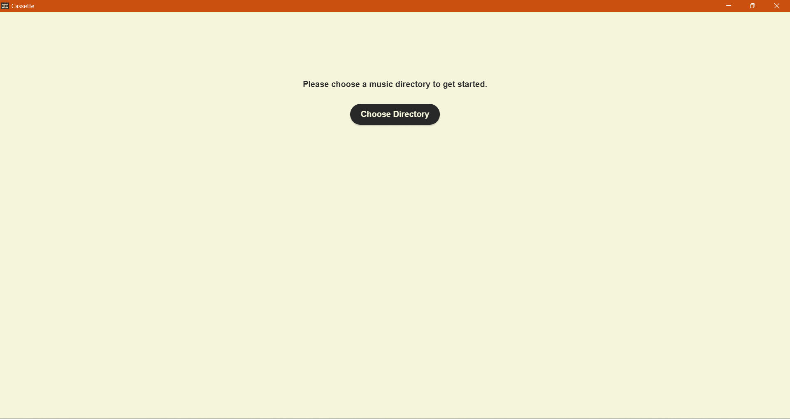
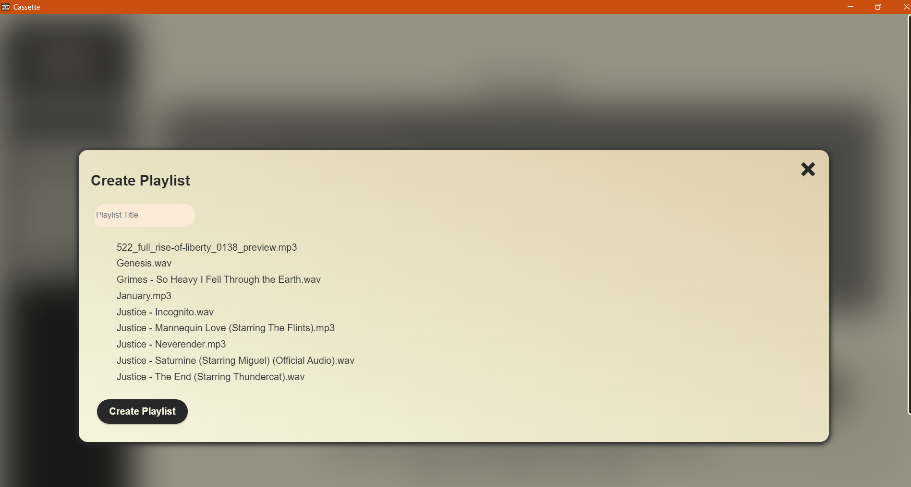

# Cassette 

## What is Cassette
Cassette is a desktop music player that allows you to play music files from a local directory on your device, organize music in playlists and search through your directory, leveraging Rust's power for audio playback and html, css and javascript to provide a flexible user interface. Because of Tauri's capabilities the use of native webview is possible without compromising the final size of the application binary. Cassette served as my diploma project for my BCSE.

## Features
- Powerful audio playback, leveraging Rodio and Rust
- Modularity by separating playback, file management and UI
- Flexible and user-friendly interface that can easily be built for any platform's webview
- Small binary size, thanks to Tauri
- Ability to create, edit and delete playlists.
- Change directory when you desire
- Search, select and play any song from your library
- Supports key presses for controlling media playback
- Currently supports only mp3 and wav

## Installation
### 1. Check Releases
1. Go to releases and download the setup.exe or the appropriate file for your system
2. (On Windows)If your system prompts you that the file is dangerous, click on 'More info' and press 'Run Anyway', this is because of Microsoft's policies towards third party apps and code signing and not because this app or simmilar apps are inherently dangerous.
3. (Other Systems) Haven't tested it but the process should be simmilar if you get prompted that the file is dangerous, or unrecognized
### 2. Build yourself
1. Clone this repo

        git clone https://github.com/Lyubo33/Cassette-music-player.git
2. Open it as a tauri project( for more info on that check [Tauri's documentation](https://tauri.app/v1/guides/getting-started/prerequisites))
3. Build a release for your system by calling:

            cargo tauri build --release

## Usage and Contributing
### Usage
1. On initital setup only a button to select a directory will be shown
2. After clicking it and selecting a directory from the dialog window, the entire interface will be shown
3. In the middle block you will see you entire library, you can click on a song to start playing it, or click play to start playing from the first one
4. Using the sidebar buttons you could create playlists, search for a specific song by typing its title or choose another directory
5. The buttons to edit/delete the playlist appear next to the playlist name when you hover over it, clicking on a playlist starts playback from it
6. Playlists are stored in a json file in the app's directory as well as the config json which stores the path to the current chosen directory

### Contributing
Contributers are welcome, if you have desire to contribute please submit a pull request

## Known limitations
- Would be good to add support for more formats
- There needs to be better error handling
- Distributing and testing for more platforms( Currently tested only on Win10/11)
- Making the UI more flexible

## Screenshots

## Resources
- [Rust book]( https://doc.rust-lang.org/book)
- [Tauri Architecture]( https://tauri.app/v1/references/architecture) 
- [Tauri guides](https://tauri.app/v1/guides/) helpful guides for configuring and using tauri
- [Rodio]( https://docs.rs/rodio/latest/rodio/)
- [Awesome Tauri repo filled with amazing Tauri projects]( https://github.com/tauri-apps/awesome-tauri/)
- [Paint]( https://www.microsoft.com/en-us/windows/paint) used to create the logo
- [Font awesome]( https://fontawesome.com/icons/) for the icons in the app
- [Raw pixel]( https://www.rawpixel.com) for the cassette reels and the base logo images

## Contact
If you have any questions, feel free to reach out to me at: [lyubopetrov13@gmail.com](mailto:lyubopetrov13@gmail.com) 

